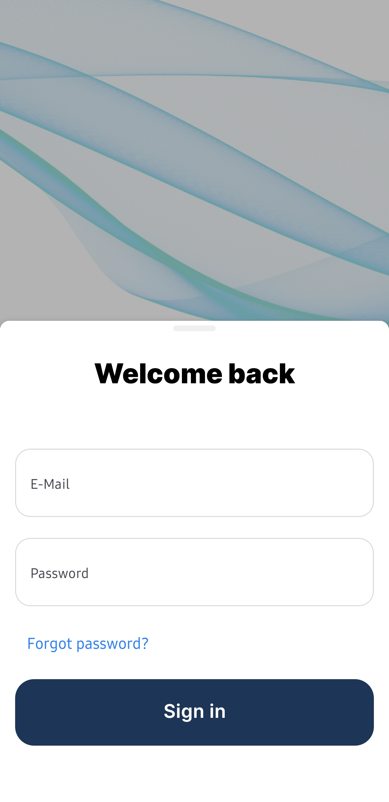
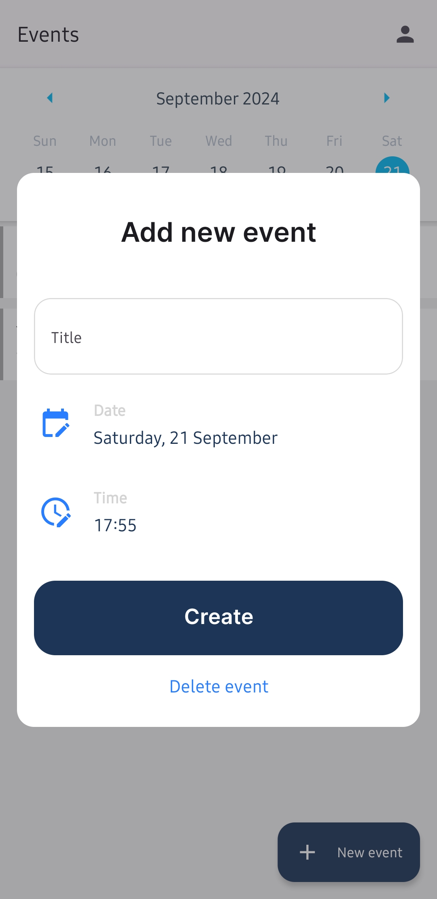
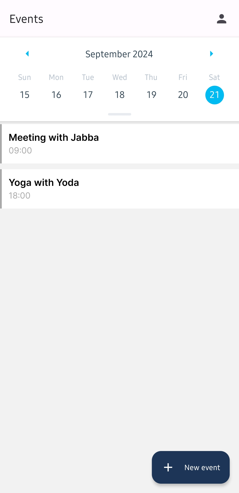

# Calendar App

## Description

This is a basic CRUD (Create, Read, Update, Delete) calendar application built with React Native using Expo. The app allows users to manage calendar events with full CRUD functionality. Authentication is handled via Firebase, and events are stored in Firestore.

## Features

- **Authentication**: Sign up, sign in, and sign out using Firebase Authentication.
- **Event Management**: Create, view, update, and delete calendar events.
- **Firestore Integration**: Store and retrieve events from Firestore.

## Screenshots

<details>
  <summary>Expand</summary>
  
  
  
  
  
</details>

## Requirements

- **Node.js**: Version 12 or higher
- **Expo CLI**: Install globally with `npm install -g expo-cli`
- **Java Development Kit (JDK)**: Required for Android development. Ensure you have JDK 8 or higher installed.
- **Android Studio**: For Android emulator and development tools.
- **Xcode**: For iOS development (macOS only).

## Setup

Follow these steps to set up the project on your local machine:

1. **Clone the Repository**

   ```bash
   git clone https://github.com/Reinboo/CalendarApp.git
   cd CalendarApp
   ```

2. Install dependencies

   ```bash
   npm install
   ```

3. Add Firebase Configuration

- Create a Firebase project if you haven't already.
- Download the google-services.json for Android and GoogleService-Info.plist for iOS from the Firebase console.
- Place the google-services.json file in the android/app directory.
- Place the GoogleService-Info.plist file in the ios/CalendarApp directory.

4. Start the app

   ```bash
    npx expo start
   ```

5. Running on Mobile Devices

- Android: Use the Expo Go app from the Google Play Store or Android Emulator.
- iOS: Use the Expo Go app from the App Store or an iOS Simulator (Xcode required).

In the output, you'll find options to open the app in a

- [development build](https://docs.expo.dev/develop/development-builds/introduction/)
- [Android emulator](https://docs.expo.dev/workflow/android-studio-emulator/)
- [iOS simulator](https://docs.expo.dev/workflow/ios-simulator/)
- [Expo Go](https://expo.dev/go), a limited sandbox for trying out app development with Expo
